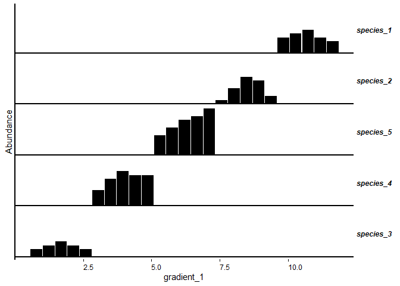

# ordenaR


# [ordenaR](https://github.com/Edbbioeco/ordenaR)

> Ordering species abundance by gradients

# Download and load package

``` r
library(remotes)

remotes::install_github("Edbbioeco/ordenaR")

library(ordenaR)
```

or simply:

``` r
install.packages("ordenaR")

library(ordenaR)
```

# Package funcionality

This package works to better understand species ordering by gradients,
and how gradients affect communities composition structure ([Hill,
1973](https://www.jstor.org/stable/2258931)). {ordenaR} package can
analyse species abundance under direct and indirect gradients
([Magnusson & Bacchario,
2021](https://www.researchgate.net/publication/362367115_Exploring_patterns_in_ecological_data_with_multivariate_analyses)):

- Direct gradients: numeric values gradients, such as temperature,
  humidity, altitude, and such else numeric variables;

- Indirect gradients, categorical values gradients, such as sample
  units, vegetation structure, location types, and such else categorical
  variables.

That package aload to use four functions:

- data_ordenar: input data for exemples;

- order_bar: ordering species by barplots

- order_circles: ordering species by circlesplots

- order_species: ordering species and ranking them into a dataframe.

# Input data

Toour exemples, we use ordenaR package data. First, lets load package
and next our data.

``` r
data("data_ordenar", package = "ordenaR")

data_ordenar
```

       sample_unit gradient_1 gradient_2 species_1 species_2 species_3 species_4
    1         p-01   1.232083     6.5625         0         0         3         0
    2         p-02   0.780000     6.1200         0         0         2         0
    3         p-03   9.821667     8.0100         4         0         0         0
    4         p-04   7.561250     3.1300         0         1         0         0
    5         p-05   3.040417     0.2700         0         0         0         4
    6         p-06   4.396667     1.1775         0         0         0         8
    7         p-07   8.917500     4.3300         0         6         0         0
    8         p-08   5.300833     2.5000         0         0         0         0
    9         p-09   8.013333     3.5300         0         4         0         0
    10        p-10   3.944583     0.8750         0         0         0         9
    11        p-11  10.725833     8.9500         6         0         0         0
    12        p-12   4.848750     1.4800         0         0         0         8
    13        p-13   8.465417     3.9300         0         7         0         0
    14        p-14   3.492500     0.5725         0         0         0         7
    15        p-15   2.136250     7.4475         0         0         3         0
    16        p-16   2.588333     7.8900         0         0         2         0
    17        p-17   1.684167     7.0050         0         0         4         0
    18        p-18   6.205000     2.8350         0         0         0         0
    19        p-19  10.273750     8.4800         5         0         0         0
    20        p-20   9.369583     4.7300         0         2         0         0
    21        p-21   5.752917     2.6675         0         0         0         0
    22        p-22  11.630000     9.8900         3         0         0         0
    23        p-23   7.109167     3.1700         0         0         0         0
    24        p-24   6.657083     3.0025         0         0         0         0
    25        p-25  11.177917     9.4200         4         0         0         0
       species_5
    1          0
    2          0
    3          0
    4          0
    5          0
    6          0
    7          0
    8          5
    9          0
    10         0
    11         0
    12         0
    13         0
    14         0
    15         0
    16         0
    17         0
    18         9
    19         0
    20         0
    21         7
    22         0
    23        12
    24        10
    25         0

Next, lets get a summary about our data variables.

``` r
library(dplyr)

data_ordenar |> dplyr::glimpse()
```

    Rows: 25
    Columns: 8
    $ sample_unit <chr> "p-01", "p-02", "p-03", "p-04", "p-05", "p-06", "p-07", "p…
    $ gradient_1  <dbl> 1.232083, 0.780000, 9.821667, 7.561250, 3.040417, 4.396667…
    $ gradient_2  <dbl> 6.5625, 6.1200, 8.0100, 3.1300, 0.2700, 1.1775, 4.3300, 2.…
    $ species_1   <dbl> 0, 0, 4, 0, 0, 0, 0, 0, 0, 0, 6, 0, 0, 0, 0, 0, 0, 0, 5, 0…
    $ species_2   <dbl> 0, 0, 0, 1, 0, 0, 6, 0, 4, 0, 0, 0, 7, 0, 0, 0, 0, 0, 0, 2…
    $ species_3   <dbl> 3, 2, 0, 0, 0, 0, 0, 0, 0, 0, 0, 0, 0, 0, 3, 2, 4, 0, 0, 0…
    $ species_4   <dbl> 0, 0, 0, 0, 4, 8, 0, 0, 0, 9, 0, 8, 0, 7, 0, 0, 0, 0, 0, 0…
    $ species_5   <dbl> 0, 0, 0, 0, 0, 0, 0, 5, 0, 0, 0, 0, 0, 0, 0, 0, 0, 9, 0, 0…

To our analysis, we use dataframe/tibble class objetos, containg:

- A column contain direct gradient (numeric values) or indirect gradient
  (categorical values). Pay attention whether your indirect gradient are
  contained on row names (i.e. sample units). If it is true, turn it
  into a columns, such using tibble::rownames_to_column() function,
  previously;

- A set of Columns containing species abundance data. Pay attention such
  species abundance data are conttained by a single column.

# Get species rank

To best ordering species under a gradient, we relocate them in a plot,
to better understand how gradients affets species abundance. This is
based on Hill ([1973](https://www.jstor.org/stable/2258931)),
calculating reciprocal average, where every species get a rank, and we
relocate the species based on this rank. For indirect gradients, we
assumes a theorical gradient (i.e. 1, 2. 3, 4,…, n<sub>bservation</sub>)
and calcule them.

$$K_{PE} = \frac{\sum_{i = 1} \left(P_i * E_i \right)}{\sum_{i = 1} P_i}$$

- $P_i$ = abundancie for species $P$ to row $i$;

- $E_i$ = value to gradient $E$ to row $i$.

Now, let’s to analyse our data to a direct gradient. We informe our
gradient column (`gradient` argument), a column named by `gradient_1`,
and species abundance data (`species` argument), a column set ranging
from 4th to 8th column in our data frame.

``` r
ordenaR::order_species(data = data_ordenar,
                       gradient = "gradient_1",
                       species = 4:8)
```

    # A tibble: 5 × 3
      specie    `Reciprocal average`  Rank
      <chr>                    <dbl> <int>
    1 species_1                10.7      1
    2 species_2                 8.56     2
    3 species_5                 6.38     3
    4 species_4                 4.06     4
    5 species_3                 1.68     5

``` r
ordenaR::order_species(data = data_ordenar,
                       gradient = "gradient_2",
                       species = 4:8)
```

    # A tibble: 5 × 3
      specie    `Reciprocal average`  Rank
      <chr>                    <dbl> <int>
    1 species_1                8.89      1
    2 species_3                7.00      2
    3 species_2                4.01      3
    4 species_5                2.90      4
    5 species_4                0.951     5

And now to a indirect gradient, only informing `direct = FALSE`.

``` r
ordenaR::order_species(data = data_ordenar,
                       gradient = "sample_unit",
                       species = 4:8,
                       direct = FALSE)
```

    # A tibble: 5 × 3
      specie    `Reciprocal average`  Rank
      <chr>                    <dbl> <int>
    1 species_5                20.1      1
    2 species_1                15.4      2
    3 species_3                10.9      3
    4 species_2                10.6      4
    5 species_4                 9.78     5

# Ploting by bar plots

The main reason to ordering species is to know how to best visualize
species abundance along a gradient. It remains the fact there is not a
intrinsec reason to alocate a x-species abundance firts to a y-species
abundance. That way, any species can be in any position in a plot. That
best species postion configuration is setted by species rank, previously
calculated.

Now, we build a barplot to a direct gradient, similar to
`ordenaR::order_species()` function.

``` r
ordenaR::order_bar(data = data_ordenar,
                   gradient = "gradient_1",
                   species = 4:8)
```


